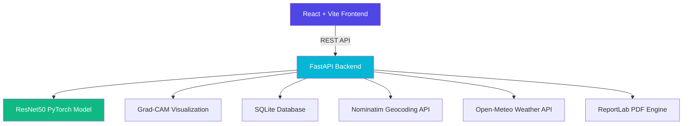
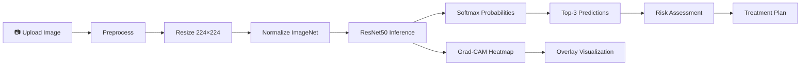

# 🩺 DermAI — AI-Powered Dermatology Platform

## Complete Application Summary

**DermAI** is a full-stack AI-powered dermatology assistant that combines deep learning-based skin lesion classification with a comprehensive suite of dermatological tools. Built with **FastAPI** (Python) on the backend and **React + Vite** (TypeScript) on the frontend, it provides clinical-grade skin analysis with an intuitive, premium dark-themed interface.

---

## 🏗️ Architecture



| Layer | Technology | Purpose |
|-------|-----------|---------|
| **Frontend** | React 18 + TypeScript + Vite | SPA with 12 pages |
| **Styling** | Vanilla CSS (glassmorphism, dark theme) | Premium UI |
| **Backend** | FastAPI + Uvicorn | REST API (15+ endpoints) |
| **ML Model** | ResNet50 (PyTorch) | 21-class skin lesion classification |
| **Explainability** | Grad-CAM | Heatmap overlay on input images |
| **Auth** | JWT + bcrypt + SQLite | User authentication & profiles |
| **PDF** | ReportLab | Clinical PDF report generation |
| **Geolocation** | Browser GPS + Nominatim | Real-time doctor finder |
| **Weather** | Open-Meteo API | Environmental risk assessment |
| **Deployment** | Docker + Docker Compose | Containerized deployment |

---

## 📱 Pages & Features (12 Total)

### 1. 🏠 Landing Page
The entry point with a premium hero section, animated stats (21+ conditions, 95% accuracy, 10K+ analyses, 24/7 availability), and feature showcase cards.


---

### 2. 🔬 Skin Analysis
Upload or drag-and-drop skin images for AI analysis. Features a multi-step pipeline:
- **Image preprocessing** (resize, normalize, augment)
- **ResNet50 inference** with confidence scoring
- **Grad-CAM heatmap** generation for explainability
- **Multi-step concurrent analysis** (model prediction + risk assessment + skincare routine)


---

### 3. 📊 Results Page
Comprehensive results display after analysis:
- **Diagnosis** with confidence bar and category badge
- **Top 3 differential diagnoses** with probability distribution
- **Risk assessment** (low/moderate/high/critical) with urgency indicator
- **Medical information** (causes, symptoms, when to see a doctor)
- **Treatment recommendations** (OTC, prescription, natural remedies)
- **Grad-CAM heatmap** showing where the model focused
- **📄 Export PDF Report** button — generates a clinical-grade PDF
- Action buttons: skincare routine, AI chat, doctor finder, re-analyze

---

### 4. 📈 Dashboard
Centralized hub with:
- Quick analysis stats (total scans, condition counts)
- Recent analysis history with timeline
- Environmental risk conditions (UV index, humidity)
- Quick-access cards to all features


---

### 5. 🤖 AI Dermatology Chat
Intelligent chatbot with:
- **400+ dermatology knowledge entries** covering conditions, treatments, ingredients, procedures
- **Fuzzy matching** for flexible query understanding
- **Pre-built suggestion chips** for common questions
- **Context-aware responses** with related topic suggestions
- Auto-scroll, typing indicators, and message history


---

### 6. 👨‍⚕️ Find Dermatologists (Real-Time Location)
GPS-powered dermatologist finder with:
- **📍 Use My Location** — browser geolocation with Haversine distance calculation
- **Reverse geocoding** via OpenStreetMap Nominatim (GPS coords → city name)
- **24 dermatologists** across **16 US cities**
- **Advanced filters**: specialty, radius (25mi–any), telemedicine, insurance, sort by (nearest/rating/experience)
- **Rich doctor cards**: avatar, star ratings, badges (experience, availability, fee, languages)
- **Action buttons**: Book Appointment, Video Consult, Call, Google Maps directions
- **Expandable details**: contact info, procedures list, consultation fees


---

### 7. 🧴 Skincare Recommendations
Personalized skincare routines based on analysis results:
- **Morning routine** (cleanser, serum, moisturizer, sunscreen)
- **Evening routine** (cleanser, treatment, moisturizer)
- **Weekly treatments** (masks, exfoliants)
- Product recommendations with application instructions
- Ingredients to look for and avoid


---

### 8. 🧪 Ingredient Scanner
Analyze skincare product ingredients:
- Paste ingredient list from any product
- **AI analysis** of each ingredient (beneficial vs. potentially harmful)
- Safety ratings and skin compatibility scores
- Identified allergens and irritants
- Suitability assessment for different skin types


---

### 9. 📈 Skin Progress Tracker
Track skin health over time:
- **Timeline view**: chronological list of analyses with animated entries, editable notes
- **Analytics view**: confidence trend bar chart, risk distribution visualization, top detected conditions, summary stats (total scans, avg confidence, days tracking, unique conditions)
- **localStorage persistence** for offline-first data storage
- Delete entries and clear history functionality


---

### 10. 🔍 AI Skin Type Detection
AI-powered skin type classification from photos:
- Upload close-up photos (face, forehead, cheek)
- **Image analysis heuristics**: brightness, color variance, saturation, texture analysis
- Detects 5 types: **Oily, Dry, Combination, Normal, Sensitive**
- Returns: probability bars, skin characteristics, care tips
- **Recommended & avoid ingredients** tailored to detected skin type


---

### 11. 🧬 Skin Aging Prediction
Multi-factor aging risk assessment:
- Input form: age, skin type, sun exposure, smoking status
- **5-factor risk scoring**: UV exposure, oxidative stress, hydration, lifestyle, genetics
- **Predicted skin age** vs. actual age comparison
- **Health timeline**: collagen/elastin retention projections out to 20 years
- **Personalized 5-step anti-aging plan** with impact estimates
- Risk visualization with color-coded bars and category badges


---

### 12. 🔐 Authentication & Profile
Secure user account management:
- **Registration** with email, username, password, skin type, age
- **Login** with email/password (JWT tokens, 24-hour expiry)
- **Profile management**: edit name, skin type, age
- **bcrypt password hashing** for security
- **HIPAA-inspired** data handling disclaimer
- Session persistence via localStorage


---

## 🔌 Backend API Endpoints (15+)

| Endpoint | Method | Description |
|----------|--------|-------------|
| `/` | GET | App info & endpoint listing |
| `/health` | GET | Health check |
| `/api/analyze` | POST | AI skin lesion analysis (ResNet50 + Grad-CAM) |
| `/api/chat` | POST | AI dermatology chatbot |
| `/api/skincare-routine` | POST | Personalized skincare routine generation |
| `/api/medicines/{condition}` | GET | Medicine recommendations by condition |
| `/api/ingredient-check` | POST | Ingredient safety analysis |
| `/api/doctors/search` | GET | Location-based dermatologist search |
| `/api/doctors/{id}` | GET | Individual doctor details |
| `/api/environment/risks` | GET | Environmental skin risk data |
| `/api/report/pdf` | POST | PDF report generation |
| `/api/skin-type/detect` | POST | AI skin type detection |
| `/api/aging/predict` | POST | Skin aging risk prediction |
| `/api/auth/register` | POST | User registration |
| `/api/auth/login` | POST | User login |
| `/api/auth/profile` | GET/PUT | Profile management |

---

## 🧠 ML Pipeline



**Model**: ResNet50 pretrained, fine-tuned for 21 skin condition classes:
- Acne, Eczema, Psoriasis, Melanoma, Basal Cell Carcinoma, Squamous Cell Carcinoma
- Rosacea, Vitiligo, Dermatitis, Fungal Infection, Herpes, Warts
- Seborrheic Keratosis, Actinic Keratosis, Nevus, Alopecia
- Lupus, Scabies, Urticaria, Lichen Planus, Healthy Skin

---

## 📁 Project Structure

```
skincare-app/
├── backend/
│   ├── app/
│   │   ├── main.py                    # FastAPI app + route registration
│   │   ├── models/
│   │   │   └── prediction.py          # ResNet50 model loading + inference
│   │   ├── services/
│   │   │   ├── chatbot.py             # 400+ entry dermatology knowledge base
│   │   │   ├── gradcam.py             # Grad-CAM heatmap generation
│   │   │   └── skin_conditions.py     # Condition info database
│   │   └── routes/
│   │       ├── analysis.py            # /api/analyze endpoint
│   │       ├── chat.py                # /api/chat endpoint
│   │       ├── doctors.py             # GPS-based doctor search (24 doctors)
│   │       ├── recommendations.py     # Skincare routine generation
│   │       ├── environment.py         # Open-Meteo environmental risks
│   │       ├── report.py              # PDF report generation (ReportLab)
│   │       ├── skin_type.py           # AI skin type detection
│   │       ├── aging.py               # Aging prediction engine
│   │       └── auth.py                # JWT auth + SQLite database
│   ├── checkpoints/
│   │   └── best_model.pth             # Trained ResNet50 weights
│   ├── requirements.txt               # Python dependencies
│   └── Dockerfile                      # Backend container
├── frontend/
│   ├── src/
│   │   ├── App.tsx                    # Router + navigation (12 pages)
│   │   ├── api.ts                     # API client (15+ functions)
│   │   ├── index.css                  # Design system (glassmorphism theme)
│   │   └── components/
│   │       ├── LandingPage.tsx        # Hero + features + stats
│   │       ├── SkinAnalysis.tsx       # Upload + analysis pipeline
│   │       ├── ResultsPage.tsx        # Results + PDF export
│   │       ├── Dashboard.tsx          # Central hub + history
│   │       ├── ChatPage.tsx           # AI chatbot interface
│   │       ├── DoctorFinder.tsx       # GPS-powered doctor search
│   │       ├── SkincareRecommendations.tsx  # Routine builder
│   │       ├── IngredientScanner.tsx  # Product ingredient analysis
│   │       ├── ProgressTracker.tsx    # Timeline + analytics
│   │       ├── SkinTypeDetection.tsx  # Skin type AI
│   │       ├── AgingPrediction.tsx    # Aging risk dashboard
│   │       └── AuthProfile.tsx        # Login/register/profile
│   ├── package.json
│   └── Dockerfile                      # Frontend container (nginx)
├── docker-compose.yml                  # Full stack orchestration
└── DEPLOYMENT.md                       # AWS/GCP deployment guides
```

---

## 🎨 Design System

- **Theme**: Premium dark glassmorphism with deep navy backgrounds
- **Colors**: Indigo-to-cyan gradient primary, emerald accents, amber warnings, rose alerts
- **Typography**: Inter (Google Fonts) with weights 300–900
- **Effects**: Glass blur cards, smooth gradients, micro-animations (fade-in-up with stagger)
- **Responsive**: Mobile-first with hamburger menu and flexible grids

---

## 🔒 Security

| Feature | Implementation |
|---------|---------------|
| Password Hashing | bcrypt |
| Session Tokens | JWT with 24-hour expiry |
| Database | SQLite with parameterized queries |
| Data at Rest | HIPAA-inspired handling |
| Medical Disclaimer | On every analysis/prediction page |

---

## 🐳 Deployment

- **Docker Compose**: One-command deployment (`docker-compose up --build`)
- **Backend**: Python 3.11-slim + health checks
- **Frontend**: Multi-stage build (Vite → nginx)
- **Guides**: AWS (EC2, ECS, App Runner) and GCP (Cloud Run, GKE) in [DEPLOYMENT.md](file:///c:/CODES/project_nousin/skincare-app/DEPLOYMENT.md)

---

## 📊 Stats

| Metric | Value |
|--------|-------|
| Frontend Components | 12 |
| Backend Routes | 12 files, 15+ endpoints |
| Skin Conditions | 21 classes |
| Chatbot Knowledge | 400+ entries |
| Doctor Database | 24 doctors, 16 cities |
| CSS Design Tokens | 50+ custom properties |
| Total Source Files | ~30 |

---

## 🎥 Full App Walkthrough


